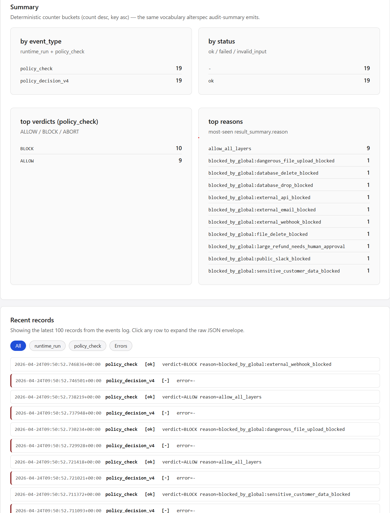

# AlterSpec AI Firewall Demo

Public integration demo showing **AlterSpec** as an **AI Action Firewall** before AI tools execute.

This repository is a demo application. The core AlterSpec engine remains private.

## What this demo shows

An AI agent attempts to execute 19 different tool actions across multiple categories:

- Email
- Slack
- File access
- API calls
- Database operations
- Payments
- Customer data access
- File uploads
- Webhooks

AlterSpec checks every action before execution.

Expected result:

    ALLOW: 9
    BLOCK: 10

## Dashboard preview

The dashboard shows the official AlterSpec audit log after the demo runs:

- 19 policy checks
- 19 policy decision records
- 9 allowed actions
- 10 blocked actions
- full reason trail for every block

## Why this matters

AI agents should not execute real-world actions directly.

This demo proves the safer pattern:

    AI Agent
       ↓
    AlterSpec Policy Check
       ↓
    ALLOW / BLOCK
       ↓
    Tool Execution or Block
       ↓
    Audit Log
       ↓
    AlterSpec Dashboard

Only actions approved by policy reach the tool layer.

Blocked actions never execute.

## Actions covered

### Allowed actions

- Internal email
- Safe file read
- Internal API call
- Internal Slack post
- Database SELECT
- Small refund
- Public customer data read
- Safe file upload
- Internal webhook

### Blocked actions

- External email
- File delete
- External API call
- Public Slack leak
- Database DELETE
- Database DROP
- Large refund
- Sensitive customer data read
- Dangerous file upload
- External webhook

## Project structure

    alterspec-ai-firewall-demo/
    |
    |-- alterspec_langchain_advanced_firewall_demo.py
    |-- run_demo.ps1
    |-- requirements.txt
    |-- README.md
    |-- EXPECTED_OUTPUT.md
    |-- ARCHITECTURE.md
    |-- .env.example
    |
    |-- policies/
    |   |-- advanced_ai_firewall_policy.yaml
    |
    |-- workspace/
    |   |-- readme.txt
    |
    |-- screenshots/
        |-- dashboard-audit-summary.png

## Requirements

- Python 3.11+
- AlterSpec installed locally or available privately
- langchain-core

Install demo dependencies:

    py -m pip install -r requirements.txt

Important: this public demo imports AlterSpec, but the AlterSpec core repository is private.

## Run the demo

From this repository:

    .\run_demo.ps1

Expected terminal summary:

    SUMMARY
    ALLOW: 9
    BLOCK: 10

## Open the AlterSpec dashboard

Start the dashboard from your private AlterSpec checkout:

    cd "path\to\private\AlterSpec\alterspec"
    py tools\alterspec_dashboard\dev_server.py

Then open:

    http://127.0.0.1:8765/audit.html

Expected dashboard result:

    Top verdicts:
    ALLOW 9
    BLOCK 10

## Policy file

The demo policy lives here:

    policies/advanced_ai_firewall_policy.yaml

It defines which AI actions are allowed and which are blocked.

Examples:

- allow internal company email
- block external email
- allow database SELECT
- block database DELETE and DROP
- allow small refund
- block large refund
- allow internal webhook
- block external webhook

## What this proves

This demo demonstrates that AlterSpec can act as a policy enforcement layer for AI applications.

It can sit between:

- an LLM agent
- LangChain-style tools
- internal business systems
- external APIs
- sensitive customer data
- financial operations

and enforce policy before tool execution.

## Important note

This repository is public only as a demo integration.

The core AlterSpec engine remains private.

This repo does not contain the private AlterSpec source code.
